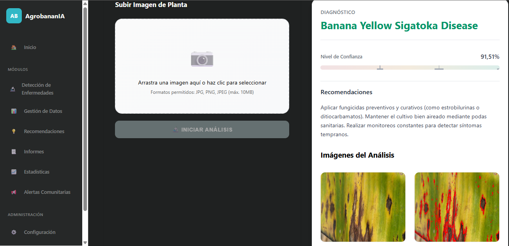

# 🍌 Sistema de Detección de Enfermedades en Hojas de Banano


Sistema inteligente de detección automática de enfermedades en hojas de banano utilizando modelos de Deep Learning con arquitectura CNN (Convolutional Neural Networks). Este sistema integral proporciona herramientas completas para la gestión, análisis y monitoreo de la salud de plantaciones de banano.

## 📋 Tabla de Contenidos

- [🍌 Sistema de Detección de Enfermedades en Hojas de Banano](#-sistema-de-detección-de-enfermedades-en-hojas-de-banano)
  - [📋 Tabla de Contenidos](#-tabla-de-contenidos)
  - [✨ Características](#-características)
  - [🛠️ Tecnologías](#️-tecnologías)
  - [🎬 Demostración](#-demostración)
    - [Módulo de Detección](#módulo-de-detección)
  - [📦 Instalación](#-instalación)
    - [Requisitos Previos](#requisitos-previos)
    - [Pasos de Instalación](#pasos-de-instalación)
  - [🧠 Modelo de Deep Learning](#-modelo-de-deep-learning)
    - [Arquitectura CNN](#arquitectura-cnn)
    - [Características del Modelo](#características-del-modelo)
  - [📊 Funcionalidades por Módulo](#-funcionalidades-por-módulo)
    - [🔍 Módulo de Detección de Enfermedades](#-módulo-de-detección-de-enfermedades)
    - [🔔 Módulo de Alertas Comunitarias](#-módulo-de-alertas-comunitarias)
    - [📈 Módulo de Estadísticas](#-módulo-de-estadísticas)
    - [💡 Módulo de Recomendaciones](#-módulo-de-recomendaciones)
    - [📄 Módulo de Informes](#-módulo-de-informes)
    - [📊 Módulo de Gestión de Datos](#-módulo-de-gestión-de-datos)
  - [📚 Documentación Adicional](#-documentación-adicional)
    - [Recursos Útiles](#recursos-útiles)
    - [Enfermedades del Banano](#enfermedades-del-banano)
  - [📄 Licencia](#-licencia)
  - [👥 Autores](#-autores)
  - [🙏 Agradecimientos](#-agradecimientos)
  - [📞 Contacto](#-contacto)

## ✨ Características

- **🔍 Detección de Enfermedades**: Análisis automático de imágenes mediante modelos CNN entrenados con alta precisión
- **📊 Gestión de Datos**: Sistema completo de almacenamiento y organización de análisis históricos
- **💡 Recomendaciones Inteligentes**: Sugerencias personalizadas de tratamiento según la enfermedad detectada
- **📄 Generación de Informes**: Reportes detallados en PDF con diagnósticos y recomendaciones
- **📈 Estadísticas y Visualización**: Dashboard interactivo con métricas y análisis de tendencias
- **🔔 Alertas Comunitarias**: Sistema de notificaciones en tiempo real para compartir información entre usuarios

## 🛠️ Tecnologías

- **Lenguaje**: Python 3.8+
- **Deep Learning**: TensorFlow/Keras
- **Framework Web**: Django
- **Base de Datos**: SQLite
- **Frontend**: HTML5, CSS3, JavaScript
- **Visualización**: Matplotlib, Plotly
- **Arquitectura**: CNN (Convolutional Neural Networks)

## 🎬 Demostración

### Módulo de Detección

## 📦 Instalación

### Requisitos Previos

- Python 3.8 o superior
- pip (gestor de paquetes de Python)
- Git
- Virtualenv (recomendado)

### Pasos de Instalación

1. **Clonar el repositorio**
```bash
git clone https://github.com/Victor29239293/Django_AgroBananIA.git
cd DJANGO_AgroBananIA
```

2. **Crear y activar entorno virtual**
```bash
# Windows
python -m venv venv
.\venv\Scripts\activate

# Linux/Mac
python3 -m venv venv
source venv/bin/activate
```

3. **Instalar dependencias**
```bash
pip install -r requirements.txt
```

4. **Configurar la base de datos**
```bash
cd AgroBananIA
python manage.py makemigrations
python manage.py migrate
```

5. **Crear superusuario (administrador)**
```bash
python manage.py createsuperuser
```

6. **Ejecutar el servidor de desarrollo**
```bash
python manage.py runserver
```
## 🧠 Modelo de Deep Learning

### Arquitectura CNN

El sistema utiliza una red neuronal convolucional personalizada entrenada para detectar 6 clases de condiciones en hojas de banano:

1. **Black Sigatoka Disease** (Sigatoka Negra)
2. **Healthy Leaf** (Hoja Sana)
3. **Insect Pest Disease** (Plagas de Insectos)
4. **Moko Disease** (Enfermedad de Moko)
5. **Panama Disease** (Enfermedad de Panamá)
6. **Yellow Sigatoka Disease** (Sigatoka Amarilla)

### Características del Modelo

- Arquitectura: CNN (Convolutional Neural Networks) personalizada
- Framework: TensorFlow/Keras
- Procesamiento de imágenes: OpenCV
- Análisis avanzado: Segmentación de áreas afectadas con contornos y overlays

## 📊 Funcionalidades por Módulo

### 🔍 Módulo de Detección de Enfermedades

- Carga de imágenes de hojas de banano
- Análisis automático mediante CNN
- Detección y clasificación de enfermedades
- Visualización de áreas afectadas con:
  - Contornos de detección
  - Overlay de zonas dañadas
  - Mapas de calor
- Historial de análisis realizados
- Detalles completos de cada diagnóstico

### 🔔 Módulo de Alertas Comunitarias

- Notificaciones en tiempo real
- Alertas basadas en proximidad geográfica
- Compartir información sobre brotes detectados
- Sistema de geolocalización de plantaciones
- Historial de alertas emitidas y recibidas

### 📈 Módulo de Estadísticas

- Dashboard interactivo con métricas clave
- Gráficos de tendencias de enfermedades
- Análisis temporal de la salud del cultivo
- Visualización de datos climáticos
- Comparativas entre plantaciones

### 💡 Módulo de Recomendaciones

- Sugerencias personalizadas de tratamiento
- Guías de aplicación de fungicidas
- Prácticas de manejo integrado
- Calendario de actividades preventivas
- Protocolos de cuarentena

### 📄 Módulo de Informes

- Generación automática de reportes en PDF
- Incluye diagnóstico detallado
- Recomendaciones de tratamiento
- Imágenes procesadas del análisis
- Historial de evolución de la plantación

### 📊 Módulo de Gestión de Datos

- Registro de datos climáticos (temperatura, humedad, precipitación)
- Datos del suelo (pH, humedad, nitrógeno)
- Prácticas agrícolas realizadas
- Observaciones de campo
- Gestión de plantaciones múltiples


## 📚 Documentación Adicional

### Recursos Útiles

- [Documentación de Django](https://docs.djangoproject.com/)
- [TensorFlow Documentation](https://www.tensorflow.org/api_docs)
- [OpenCV Python Tutorials](https://docs.opencv.org/master/d6/d00/tutorial_py_root.html)
- [Keras Documentation](https://keras.io/api/)

### Enfermedades del Banano

Para más información sobre las enfermedades detectadas:
- [Sigatoka Negra](https://www.fao.org/3/y5034e/y5034e0b.htm)
- [Sigatoka Amarilla](https://www.fao.org/3/y5034e/y5034e0c.htm)
- [Enfermedad de Panamá](https://www.fao.org/3/y5034e/y5034e0d.htm)
- [Enfermedad de Moko](https://www.fao.org/3/y5034e/y5034e0e.htm)


## 📄 Licencia

Este proyecto está licenciado bajo la Licencia MIT - ver el archivo [LICENSE](LICENSE) para más detalles.

## 👥 Autores

- **Victor** - *Desarrollo Inicial* - [Victor29239293](https://github.com/Victor29239293)

## 🙏 Agradecimientos

- A la comunidad de Django por el excelente framework
- A TensorFlow/Keras por las herramientas de Deep Learning
- A todos los contribuidores que hacen posible este proyecto
- A los agricultores que inspiran el desarrollo de esta tecnología

## 📞 Contacto

Para preguntas o sugerencias:
- GitHub: [@Victor29239293](https://github.com/Victor29239293)
- Repository: [DJANGO_AgroBananIA](https://github.com/Victor29239293/DJANGO_AgroBananIA)

<div align="center">
  <p>Desarrollado con ❤️ para mejorar la agricultura sostenible</p>
  <p>🍌 AgroBananIA - Inteligencia Artificial al servicio del campo 🍌</p>
</div>


